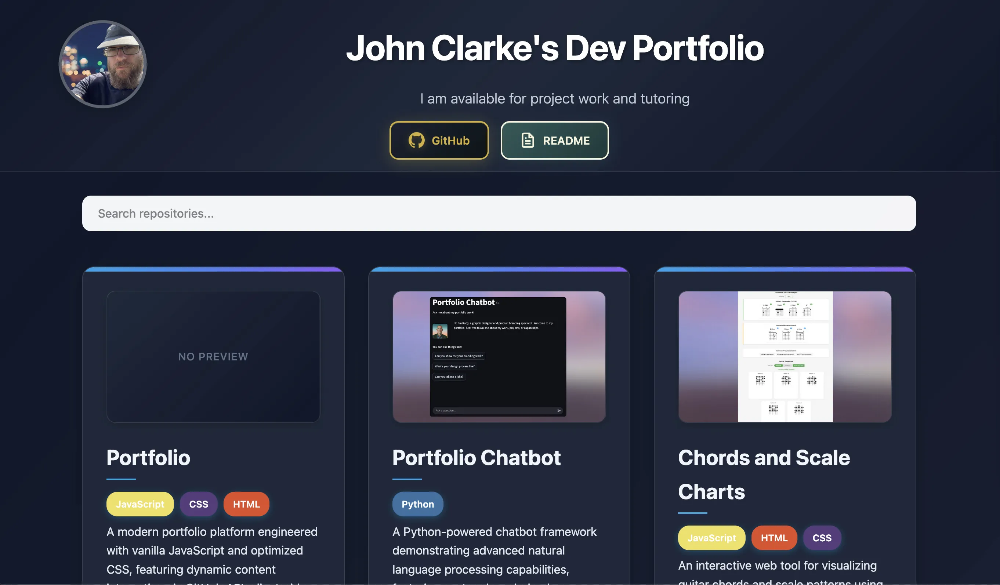

# Portfolio Site with GitHub API




A modern portfolio website that dynamically displays GitHub repositories and projects using the GitHub API. This site showcases my development work and provides an interactive way to explore my projects.


## Table of Contents
- [About the Project](#about-the-project)
- [Getting Started](#getting-started)
- [Prerequisites](#prerequisites)
- [Installation](#installation)
- [Configuration](#configuration)
- [Project Structure](#project-structure)
- [Technologies Used](#technologies-used)
- [Features](#features)
- [API Reference](#api-reference)
- [Development](#development)
- [Deployment](#deployment)
- [License](#license)

## About the Project

This portfolio website is designed to showcase my development projects and GitHub repositories in a clean, modern interface. The site dynamically fetches data from the GitHub API to display up-to-date information about my repositories, including names, descriptions, programming languages, and star counts.


The website is built with modern web technologies and follows responsive design principles to ensure optimal viewing experience across all devices, from desktop computers to mobile phones.

## Getting Started

To run this project locally, follow these steps:

1. Clone the repository
2. Install dependencies
3. Configure the GitHub API
4. Start the development server

## Prerequisites

Before you begin, ensure you have the following installed on your system:

- **Node.js** (v14.0.0 or higher)
- **npm** (v6.0.0 or higher)
- **Git** (for cloning the repository)
- **A GitHub account** (for API access)

## Installation

1. **Clone the repository:**
   ```bash
   git clone https://github.com/your-username/your-repository.git
   cd your-repository
   ```

2. **Open the project:**
   ```bash
   open index.html
   ```

## Configuration

### GitHub API Setup

1. **Update GitHub username:**
   Open `script.js` and replace `'username'` with your actual GitHub username:
   ```javascript
   const GITHUB_USERNAME = 'username'; // Replace with your GitHub username
   const USE_PUBLIC_API = true; // Set to true to use public API (60 requests/hour)
   ```

2. **Netlify Functions:**
   - For production deployment on Netlify, use serverless functions
   - Create a Netlify function to handle GitHub API calls securely
   - Add your GitHub token to Netlify environment variables
   - No client-side token exposure

3. **Local Development:**
   - For local development, you can still use environment variables
   - Add your GitHub token to your `.zshenv` file:
     ```bash
     export GITHUB_TOKEN=your_token_here
     ```
   - Reload your shell: `source ~/.zshenv`

## Project Structure

```
portfolio-site/
├── src/
│   ├── components/     # React components
│   ├── styles/        # CSS stylesheets
│   ├── utils/         # Utility functions
│   └── api/           # API integration code
├── public/            # Static assets
├── tests/             # Test files
├── .env.example       # Environment variables template
├── package.json       # Dependencies and scripts
└── README.md          # This file
```

## Technologies Used

- **HTML5**: Semantic markup for content structure
- **CSS3**: Modern styling with Flexbox and Grid layouts
- **JavaScript (ES6+)**: Modern JavaScript features for better code organization
- **GitHub API**: RESTful API for fetching repository data
- **Git**: Version control system

## Features

- **Dynamic Repository Display**: Automatically fetches and displays GitHub repositories
- **Responsive Design**: Optimized for desktop, tablet, and mobile devices
- **Modern UI**: Clean, minimalist design with smooth animations
- **Search Functionality**: Filter repositories by name or description
- **Language Detection**: Shows programming languages used in each repository
- **Star Count Display**: Shows repository popularity with star counts
- **Build-time Data with Runtime Updates**: Static data generated at build time, with runtime timestamp checking for efficient updates
- **Repository Screenshots**: Automatic screenshot matching during runtime updates with flexible naming patterns
- **SEO Optimized**: Semantic HTML and meta tags for better search engine visibility
- **Fast Loading**: Optimized assets and lazy loading for better performance
- **Build-time Processing**: Screenshot matching happens at deployment, not runtime

## API Reference

### GitHub API Endpoints Used

- **GET** `/users/{username}/repos` - Fetch user repositories
- **GET** `/repos/{owner}/{repo}` - Get repository details
- **GET** `/repos/{owner}/{repo}/languages` - Get repository languages

### Rate Limiting

- **Unauthenticated requests**: 60 requests per hour
- **Authenticated requests**: 5,000 requests per hour

## Development

- **Build-time Data Generation**: Static data is generated at build time using GitHub API
- **Runtime Timestamp Checking**: On page reload, the application checks if any repositories have been updated by comparing timestamps
- **Efficient Updates**: Only repositories that have changed since the last build are updated at runtime
- **Repository Screenshots**: Screenshots are extracted from README content during runtime updates for optimal performance


### Local Development

1. **Open the project:**
   ```bash
   open index.html
   ```

2. **View your portfolio:**
   The site will display your GitHub repositories using static data generated at build time. On page reload, the application checks for updates by comparing repository timestamps and updates only the repositories that have changed.


### Netlify Development

1. **Install Netlify CLI:**
   ```bash
   npm install -g netlify-cli
   ```

2. **Login to Netlify:**
   ```bash
   netlify login
   ```

3. **Link to Netlify site:**
   ```bash
   netlify link
   ```

4. **Start development server:**
   ```bash
   netlify dev
   ```

5. **View your portfolio:**
   The site will automatically fetch and display your GitHub repositories using authenticated API (5,000 requests/hour)

### Code Style

This project follows standard JavaScript conventions with ESLint and Prettier for code consistency.

### Contributing

1. Fork the repository
2. Create a feature branch
3. Make your changes
4. Add tests if applicable
5. Submit a pull request

## Deployment

### Netlify Deployment

1. **Connect to Netlify:**
   - Log in to Netlify
   - Click "New site from Git"
   - Select your repository

2. **Configure Build Settings:**
   - Build command: `npm run build`
   - Publish directory: `build/`

3. **Environment Variables:**
   - Add GitHub token in Netlify UI
   - Save and deploy

4. **Custom Domain (Optional):**
   - Add your custom domain
   - Configure DNS settings

## License

This project is licensed under the MIT License - see the [LICENSE](LICENSE) file for details.

## Support

For support or questions about this project, please:

- Open an issue in the repository
- Contact me directly via email

---

**Last Updated:** February 2026